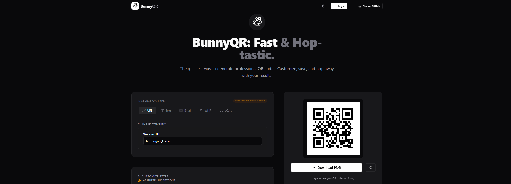

# 🐰 BunnyQR: Fast & Hop-tastic

## 🌐 Acesso ao Projeto

🔗 [**Abrir aplicação online**](https://ai.studio/apps/f4cdfc77-5065-411e-830a-17895ae3e6e8)

---

## 📌 Sobre o MVP

O **BunnyQR** é um gerador de QR Codes profissional e intuitivo. Este projeto representa a evolução de um protótipo inicial para um **Produto Mínimo Viável (MVP)**, utilizando Inteligência Artificial, design funcional e integração de recursos modernos para validação de conceito e experiência do usuário.

---

## 🚀 Funcionalidades

- **Geração Multi-formato**: Criação de QR Codes para URLs, Textos, E-mails, Wi-Fi e vCards.
- **Customização Inteligente**: Integração com **IA Generativa** para sugestões estéticas.
- **Interface Moderna**: Design responsivo e focado em UX com suporte a temas.
- **Download Instantâneo**: Botão direto para salvar o código em formato PNG.

---

## 🛠 Tecnologias Utilizadas

---

## 🖼 Preview do Projeto

---

### 💡 Como utilizar:
1. Selecione o tipo de QR Code desejado (URL, Texto, etc).
2. Insira o conteúdo no campo "Enter Content".
3. Personalize o estilo com as sugestões da IA.
4. Clique em **Download PNG** para salvar seu código.
